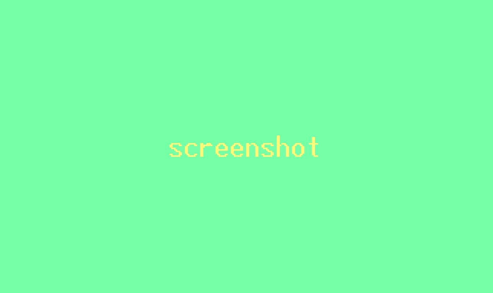

# Title
## Sections

 - [Visuals](#visuals)
 - [Description](#description)
	 - [General](#general)
	 - [Rules](#rules)
	 - [Programming languages](#programming-languages)
	 - [Systems](#systems)
	 - [Notes](#notes)
 - [Usage](#usage)
 - [Date](#date) (optional)
 
## Visuals

## Description

### General

Project description.

### Rules

**Main rules:**

 - Rules of the project

**Requirements for the project:**

 - Forbidden instructions etc.

 
### Programming languages

 - C
 
### Systems

 - Windows, Linux etc.
 
### Notes

Additional notes

## Usage

 - purpose of the project
 
### Date (optional)

- date of finishing the project at the university

